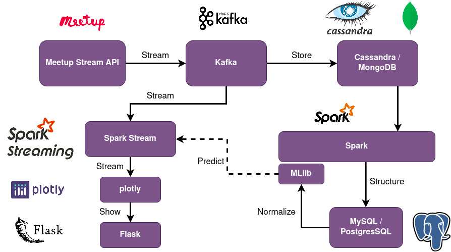

# Meetup RSVP Stream Analysis

## Abstract

Meetup is a service used to organize online groups that host in-person and virtual events for people with similar interests. It provides an API which gives us real time RSVP to these events. We try to solve two problems in here,

- Allow meetup organizers to identify trending topics related to their meetup. We computed Trending Topics based on the description of the events matching the tags of interest to us.
- See which Meetup events attract the most responses within our region.
  

## Big Data Architecture

   

## Technology Stack

- [WebSocket](https://websocket-client.readthedocs.io/en/latest/index.html) - Library used to read JSON response from meetup website.
  

## Prerequisites

- Apache Kafka
- Apache Spark
  

## How to install

``$> pipenv install --ignore-pipfile``
 or 
``$> pip install -r requirements.txt``